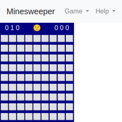

# Yet Another Minesweeper

## Production site

Go to [Stagyrite.GitHub.io/yam](https://stagyrite.github.io/yam/ "Yet Another Minesweeper"), and the game is all for you.

## Minesweeper overview

The object of Minesweeper is to locate all the mines as quickly as possible without uncovering any of them. If you uncover a mine, you lose the game.

## Play Minesweeper

To play Minesweeper

1. On the Game menu, click New.
1. To start the timer, click any square on the playing field.

Notes

* You can uncover a square by clicking it. If you uncover a mine, you lose the game.
* If a number appears on a square, it indicates how many mines are in the eight squares that surround the numbered one.
* To mark a square you suspect contains a mine, right-click it.
* The game area consists of the playing field, a mine counter, and a timer. 

## Customize the playing field

To customize the playing field

1. On the Game menu, click Custom.
1. Customize the size of the field by specifying the number of squares to display vertically and horizontally, and specify the number of mines to place on the field. 

## Strategies and tips

* If you are uncertain about a square, right-click it twice to mark it with a question mark (?). Later, you can either mark the square as a mine or remove the markings by right-clicking the square again once or twice.
* If you have marked all the mines around a numbered square, you can uncover the remaining squares around it by clicking the numbered square with the left and right mouse buttons simultaneously. If not all mines surrounding the numbered square have been marked, the remaining covered or unmarked squares will appear to be depressed (or flash) when the numbered square is clicked with both buttons simultaneously.
* Look for common patterns in numbers, which often indicate a corresponding pattern of mines. For example, the pattern 2-3-2 at the edge of a group of uncovered squares indicates a row of three mines next to the three numbers. 

## Jokes

